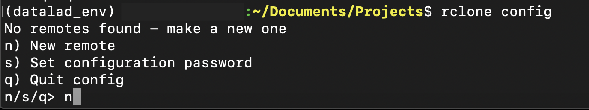
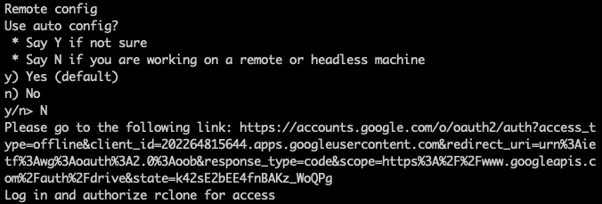
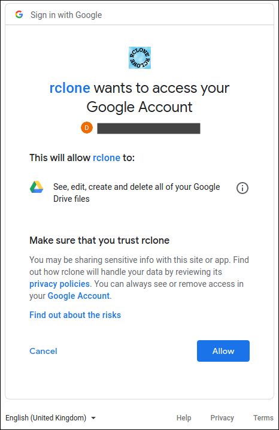
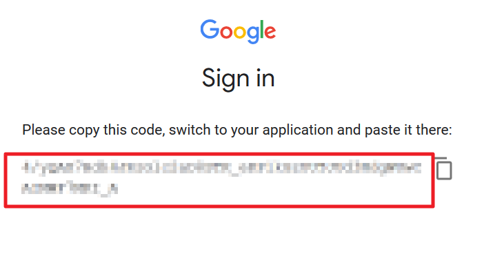
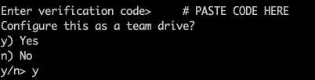
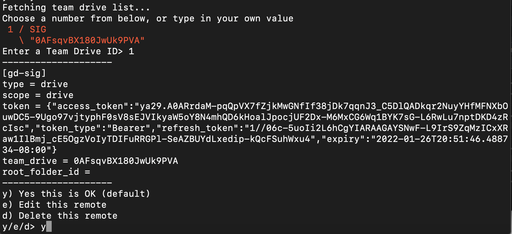

# kwyk dataset

This dataset is used to train and evaluate the [kwyk](https://github.com/neuronets/kwyk) network. We are publishing it in the form of a [datalad](https://www.datalad.org/) dataset.
The main folder includes two subfolders `rawdata` and `tfrecords`. The `rawdata` folder includes input images with the freesurfer segementation files. The `tfrecords` has the same files as in `rawdata` folder but they are saved as pair of `(image, segmetation)` in the form of tfrecords.
The data in `tfrecords` folder is separated to train and test.
To download data follow below steps,

## 1. Setup the environment
We highly recommend to create a separate environment for accessing the data. You need to install [datalad](https://www.datalad.org/), [git-annex](https://git-annex.branchable.com/) and [rclone](https://rclone.org/). Plesae check [here](https://handbook.datalad.org/en/latest/intro/installation.html#) to insttall datalad and it's dependencies based on your operating system.
For linux systems you can install datalad and dependencies using conda like below.

```
conda create -n datalad python=3
conda activatet datalad
conda install -c conda-forge rclone
conda install -c conda-forge git-annex
conda install -c conda-forge datalad
```

**Note:** If you are using the datalad for the first time, remember to [configure](https://handbook.datalad.org/en/latest/intro/installation.html#initial-configuration) it.

### install [git-annex-remote-rclone](https://github.com/DanielDent/git-annex-remote-rclone):

find path to the bin directory of your conda env with `which python`.

```
which python | grep -o ".*bin"
```
copy the **git-annex-remote-rclone** to the bin directory.

```
wget https://raw.githubusercontent.com/DanielDent/git-annex-remote-rclone/master/git-annex-remote-rclone \
  -P </path/to/conda/env/bin>
chmod +x </path/to/conda/env/bin>/git-annex-remote-rclone
```

## 2. Setup rclone remote

Now you need to setup the rclone remote.

```
rclone config
```

use `n` to setup a new remote.

<p align="center">


Except for below fields use default for everything else:

Name:gd-sig

Type of storage: 13 (Google Drive)

Scope:	1 (full access)

Auto config: No

You’ll see something like this after auto config:
	
<p align="center">


Copy the link given in the terminal.  On your local computer, open any browser and go to the link.  Log into Google Drive with the email you registered MIT G suite with and allow access to your Google account.

<p align="center">


Copy the verification code that pops up.

<p align="center">


Go back to your terminal.  Paste the code there and select ‘yes’ for team drive.

<p align="center">


Enter ID of the drive you want to add, enter yes and you’re done!

<p align="center">


## 3. Clone the dataset and enable remote

Clone this repository using datalad. Note that by cloning the repository you are getting the metadata of the files rather than the actual content.

```
datalad clone https://github.com/sensein/kwyk-data
```

Your sample output of datalad clone should look like this:

```
[INFO   ]   Remote origin not usable by git-annex; setting annex-ignore
[INFO   ] access to 1 dataset sibling gdsig not auto-enabled, enable with:
| 		datalad siblings -d "/home/testdatalad" enable -s gd-sig
install(ok): /home/testdatalad (dataset)
```

Use the 3rd line as the command after cding into cloned repo

```
cd kwyk-data
datalad siblings -d "/home/nlo/testdatalad" enable -s gdsig  # copy line from output
```

## 4. Download the data

You can use `datalad get <path/to/data file/>` to download the data.

To download the whole rawdata folder:

```
datalad get rawdata
```

To download the whole tfrecords:

```
datalaad get tfrecords
```

To download a single file, simply pass the path of the file to `datalad get`.

```
datalad get rawdata/rawdata/pac_0_orig.nii.gz
```

